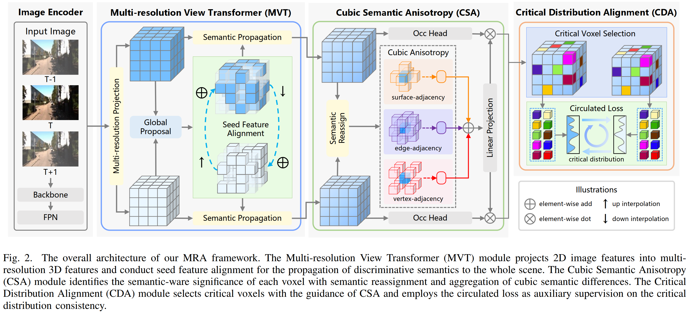

<div align="center">   
  
# Multi-Resolution Alignment for Voxel Sparsity in Camera-Based 3D Semantic Scene Completion
</div>

> **Multi-Resolution Alignment for Voxel Sparsity in Camera-Based 3D Semantic Scene Completion**. 

<!-- >  [[Arxiv]](https://arxiv.org/pdf/2312.05752.pdf) -->


<!-- ## News
- [2024/09]: Accepted by IEEE TIP 2024!
- [2023/12]: We release the evaluation results and training code for SSCBench-KITTI-360.
- [2023/12]: Our paper is on [arxiv](https://arxiv.org/pdf/2312.05752.pdf).
- [2023/08]: SGN achieve the SOTA on Camera-based [SemanticKITTI 3D SSC (Semantic Scene Completion) Task](http://www.semantic-kitti.org/tasks.html#ssc) with **15.76% mIoU** and **45.52% IoU**.
</br> -->


## Abstract
Camera-based 3D semantic scene completion (SSC) offers a cost-effective solution for assessing the geometric occupancy and semantic labels of each voxel in the surrounding 3D scene with image inputs, providing a voxel-level scene perception foundation for the perception-prediction-planning autonomous driving systems. Although significant progress has been made in existing methods, their optimization rely solely on the supervision from voxel labels and face the challenge of voxel sparsity as a large portion of voxels in autonomous driving scenarios are empty, which limits both optimization efficiency and model performance. To address this issue, we propose a Multi-Resolution Alignment (MRA) approach to mitigate voxel sparsity in camera-based 3D semantic scene completion, which exploits the scene and instance level alignment across multi-resolution 3D features as auxiliary supervision. 
Specifically, we first propose the Multi-resolution View Transformer module, which projects 2D image features into multi-resolution 3D features and aligns them at the scene level through fusing discriminative seed features.
Furthermore, we design the Cubic Semantic Anisotropy module to identify the instance-level semantic significance of each voxel, accounting for the semantic differences of a specific voxel against its neighboring voxels within a cubic area. 
Finally, we devise a Critical Distribution Alignment module, which selects critical voxels as instance-level anchors with the guidance of cubic semantic anisotropy, and applies a circulated loss for auxiliary supervision on the critical feature distribution consistency across different resolutions.
Extensive experiments on the SemanticKITTI and SSCBench-KITTI-360 datasets demonstrate that our MRA approach significantly outperforms existing state-of-the-art methods, showcasing its effectiveness in mitigating the impact of sparse voxel labels.


## Method

|  | 
|:--:| 

## Getting Started
### Installation
Please refer to [Voxformer](https://github.com/NVlabs/VoxFormer) to create base environment. Some extra packages are needed to be installed:  
- spconv-cu111==2.1.25  
- torch-scatter==2.0.8  
- tochmetrics>=0.9.0  
### Prepare Dataset
Please refer to the [README](preprocess/README.md) in the preprocess folder for details.
### Run and Eval
  
Train MRA with 4 GPUs 
```
./tools/dist_train.sh ./projects/configs/mra/MRA-T.py 4
```

Eval MRA with 4 GPUs
```
./tools/dist_test.sh ./projects/configs/mra/MRA-T.py ./path/to/ckpts.pth 4
```

## Acknowledgement

Many thanks to these excellent open source projects:
- [SGN](https://github.com/Jieqianyu/SGN)
- [HASSC](https://github.com/songw-zju/HASSC)
- [VoxFormer](https://github.com/NVlabs/VoxFormer)
- [mmdet3d](https://github.com/open-mmlab/mmdetection3d)
- [MonoScene](https://github.com/astra-vision/MonoScene)
- [AICNet](https://github.com/waterljwant/SSC)

<!-- ## Ciatation

If you find this project helpful, please consider citing the following paper:
```
@article{mei2024camera,
  title={Camera-based 3d semantic scene completion with sparse guidance network},
  author={Mei, Jianbiao and Yang, Yu and Wang, Mengmeng and Zhu, Junyu and Ra, Jongwon and Ma, Yukai and Li, Laijian and Liu, Yong},
  journal={IEEE Transactions on Image Processing},
  year={2024},
  publisher={IEEE}
}
``` -->
